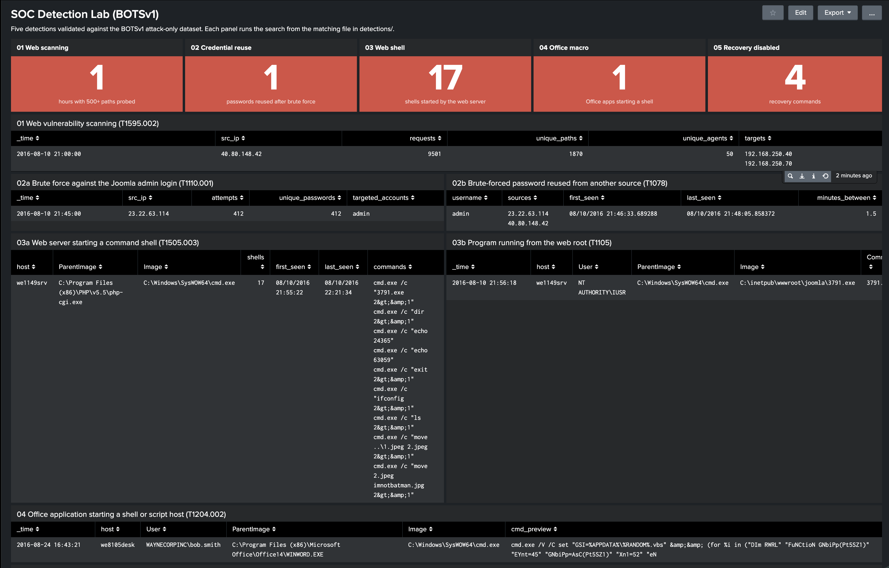

# Splunk SOC Detection Lab

A detection engineering lab built in Splunk Enterprise, running locally in Docker, against Splunk's public Boss of the SOC v1 (BOTSv1) dataset. Each detection is mapped to MITRE ATT&CK, validated against the attack data, and written up with how I chose the threshold, what could cause false positives, how an attacker could get around it, and what to do when it fires.

The project rebuilds and extends coursework from my Monash University Cybersecurity Bootcamp.



## Detections

| # | Detection | MITRE ATT&CK | Status |
|---|---|---|---|
| 01 | [Web vulnerability scanning](detections/01-web-vuln-scanning.md) | T1595.002 | Validated |
| 02 | [Brute force and credential reuse](detections/02-brute-force-credential-reuse.md) | T1110.001, T1078 | Validated |
| 03 | [Web shell and executable in the web root](detections/03-web-shell-webroot-executable.md) | T1505.003, T1059.003, T1105 | Validated |
| 04 | [Office application starting a shell or script host](detections/04-office-spawns-shell.md) | T1204.002, T1059.003, T1059.005 | Validated |
| 05 | [Ransomware disabling system recovery](detections/05-inhibit-system-recovery.md) | T1490 | Validated |

Between them they cover both attacks in the dataset. Detections 01 to 03 follow the web server compromise from scanning through to a web shell and a defaced site. Detections 04 and 05 follow the ransomware infection on a user's workstation, from a malicious Word document through to backups being destroyed.

## How it fits together

- Splunk Enterprise runs in a single Docker container. Its data and settings live in named volumes, so they survive restarts.
- BOTSv1 attack-only is installed as a Splunk app inside the container. It comes pre-indexed, so there's nothing to parse on the way in.
- The Sysmon logs in BOTSv1 arrive as raw XML with no fields extracted. `splunk-app/TA-botsv1-sysmon` is a small add-on I wrote that extracts every Sysmon field at search time. It's mounted into the container read-only from this repository.
- The searches use three data sources: Splunk Stream HTTP data, Sysmon process creation events and IIS logs.
- `dashboards/soc-detection-lab.xml` is a Classic Splunk dashboard that runs every detection on one page, with a summary tile per detection that turns red when it fires.

## Setup

This was built on an Intel Mac with Docker Desktop and 8 GB of memory given to Docker. The Splunk image is built for Intel/AMD processors, so on Apple Silicon it runs under emulation and is noticeably slower.

1. Clone the repository and create the secrets file:

```bash
   git clone https://github.com/Mephistopplz/splunk-soc-detection-lab.git
   cd splunk-soc-detection-lab
   printf "SPLUNK_PASSWORD=%s\n" "$(openssl rand -base64 18)" > docker/.env
   chmod 600 docker/.env
```

   `docker/.env` is ignored by Git. Keep the password somewhere safe, because Splunk only reads it on first start.

2. Start Splunk and wait until the container reports `(healthy)`, which takes a few minutes the first time:

```bash
   cd docker && docker compose up -d && cd ..
   docker ps --format 'table {{.Names}}\t{{.Status}}'
```

3. Download the BOTSv1 attack-only dataset and check the archive before extracting it. The second command should print only the "clean" message:

```bash
   mkdir -p data
   curl -fL -o data/botsv1-attack-only.tgz https://s3.amazonaws.com/botsdataset/botsv1/botsv1-attack-only.tgz
   tar -tzf data/botsv1-attack-only.tgz | grep -E '(^/|\.\./)' || echo "No traversal paths - clean"
```

4. Install it into Splunk and restart:

```bash
   docker cp data/botsv1-attack-only.tgz splunk-lab:/tmp/
   docker exec -u splunk splunk-lab tar -xzf /tmp/botsv1-attack-only.tgz -C /opt/splunk/etc/apps
   docker exec -u root splunk-lab rm /tmp/botsv1-attack-only.tgz
   cd docker && docker compose restart && cd ..
```

5. Open http://localhost:8000 and log in as `admin` with the password from `docker/.env`. In Search & Reporting, set the time range to All time and run:

```
   index=botsv1 | stats count by sourcetype | sort -count
```

   You should see 955,807 events across 22 sourcetypes.

6. Load the dashboard. Go to Dashboards, create a new Classic dashboard, open Source, replace its contents with `dashboards/soc-detection-lab.xml` and save. All five tiles should turn red.

To run a detection on its own, copy the search from its file in `detections/` into Search & Reporting. Check the time range is All time and Event Sampling is off before trusting the result.

## Repository layout

| Path | Contents |
|---|---|
| `docker/` | Compose file for running Splunk locally, and `.env.example` showing the one variable it needs |
| `splunk-app/TA-botsv1-sysmon/` | Search-time field extraction for Sysmon XML events |
| `detections/` | One file per detection: the search, ATT&CK mapping, baseline, validation, evasion, false positives, response and investigation notes |
| `dashboards/` | The Splunk dashboard covering all five detections |
| `docs/screenshots/` | Evidence of each detection firing, and the dashboard |

## Hardening notes

- The web interface is bound to `127.0.0.1` only. A plain `8000:8000` port mapping listens on every network interface, and Docker's port publishing gets around the macOS firewall, so that would expose the login page to anyone on the same network.
- The admin password is randomly generated into `docker/.env`, which is ignored by Git and readable only by my account. It has never been committed, and commits use a GitHub noreply email address.
- The parsing app is mounted read-only, so nothing inside the container can change the field extractions. Every change has to go through Git. Splunk's startup scripts try to change ownership of everything under its home directory and fail on a read-only mount, so I set `SPLUNK_HOME_OWNERSHIP_ENFORCEMENT` to false. That's fine for a lab, but in production I'd leave ownership enforcement on and deploy the app another way.
- Before installing the BOTSv1 archive, I listed its contents to check for path traversal and for scripts in the app's `bin` folder. It had none.
- Splunk Stream captured the full body of every login request, so passwords sit in the index in plaintext. Detection 02 counts and hashes passwords rather than showing them, but the real fix is not capturing login bodies, or masking them before they're indexed.
- No mail server is configured and no alerts are scheduled. Live alerting is out of scope.

## Limitations

- BOTSv1 attack-only is mostly attack traffic. There's very little normal activity to tune thresholds against, so every threshold here would need tuning on real data before I'd rely on it.
- The baselines are thin: five HTTP sources, and three hosts with Sysmon data across two days.
- Each detection was validated against this one dataset. Each file lists the ways I know an attacker could get past it.
- The Compose file uses the `latest` Splunk image, so a future image could behave differently. Pinning a version would make the setup fully repeatable.

## Future work

- Ransomware file activity over SMB using `stream:smb`. This was my original plan for Detection 05, before the process data turned up a stronger signal.
- An attack timeline panel on the dashboard showing both attacks in order.
- Storing the detections as scheduled searches in `savedsearches.conf` inside an app, so they're deployed as code rather than copied in by hand.
- Allowlists as Splunk lookups for known crawlers, scanners and admin tools.
- A password spraying search to go with Detection 02.
- Looking at what `agent.php` did internally, the role of `we9041srv`, and the processes I left unexamined on the workstation.
- Replacing the plaintext `.env` file with references to a password manager.
- Pinning the Splunk image version.

## What I learned

### Detection 01: web scanning

Volume alone can be misleading, because it doesn't separate scanning from other traffic. Counting distinct paths targets the behaviour and leaves out most false positives. I also learned not to trust the user agent, because the scanner used a normal Chrome one for nearly every request.

### Detection 02: brute force and credential reuse

The brute force wasn't the important part. The login from a second IP with a single attempt was, and a per-source threshold would never have caught it. I also found out that stats drops events when one of the fields you group by is empty, which is why two of my counts were off by one.

### Detection 03: web shell

An attacker can change file names whenever they want, so the web server starting a shell is a much stronger signal than looking for `agent.php`. I learned to prove which host an IP belongs to before pivoting, instead of going on the hostname, and to check the sampling setting after one search showed me 6 events instead of 105.

### Detection 04: Office macro

I didn't search for Office straight away. I listed what started what and let the data show me. When I assumed `wscript.exe` had run the script, I had to go back and prove it, because "that's what Windows normally does" isn't evidence. Leaving off one filter gave me 588 events instead of 2, and the event count was what caught it.

### Detection 05: ransomware

The original plan was SMB file activity, but the data had a better signal, so I changed the plan instead of forcing it. The shadow copy deletion happened 26 minutes before the ransom note, which is the window where a defender could still act.

### Splunk in general

- A filter on a field only works after the command that creates it, so the order of the lines matters.
- An empty result or a wrong count usually means my search is wrong, not that nothing happened. Splunk doesn't give errors for typos in field names or values.
- Field value matching isn't case sensitive, so changing capitals doesn't get past a search.
- I check the event count, time range and sampling before trusting any result.
- Investigations grow fast. I parked anything that didn't help build the detection and kept it as future work.
