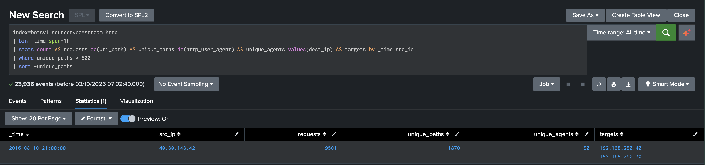

# Detection 01: Web Vulnerability Scanning

**Severity:** Low / informational (useful for correlation, not a standalone page)
**Status:** Validated against the BOTSv1 attack-only dataset

## What this catches

One source hammering a web server across a huge number of different URL paths inside an hour. That breadth is what an automated vulnerability scanner looks like on the wire, whatever tool is behind it.

## MITRE ATT&CK

- **Tactic:** Reconnaissance (TA0043)
- **Technique:** T1595.002 Active Scanning: Vulnerability Scanning
- **Related (attempted):** T1190 Exploit Public-Facing Application. The scan carried SQL, command, LDAP and expression injection payloads. This detection shows the attempts; it doesn't prove any of them landed.

## Data source

- `index=botsv1`, `sourcetype=stream:http` (Splunk Stream wire data)
- Fields: `src_ip`, `dest_ip`, `uri_path`, `http_user_agent`

## The search

```spl
index=botsv1 sourcetype=stream:http
| bin _time span=1h
| stats count AS requests dc(uri_path) AS unique_paths dc(http_user_agent) AS unique_agents values(dest_ip) AS targets by _time src_ip
| where unique_paths > 500
| sort -unique_paths
```

- `bin _time span=1h` mimics an hourly scheduled search.
- `unique_paths` is the trigger. I keyed on breadth because it's the one thing a scanner can't avoid: it has to touch a lot of paths to do its job.
- `requests`, `unique_agents` and `targets` are there so whoever picks up the alert can triage it without running five more searches. They aren't thresholds.

## How I picked the threshold

I didn't want to guess a number, so I baselined every HTTP source in the dataset first (all time):

| src_ip | requests | unique_paths | unique_agents |
|---|---|---|---|
| 40.80.148.42 | 17,547 | 1,872 | 50 |
| 23.22.63.114 | 1,429 | 2 | 183 |
| 192.168.2.50 | 818 | 163 | 2 |
| 192.168.250.100 | 93 | 42 | 11 |
| 192.168.250.70 | 7 | 4 | 0 |

The busiest legitimate client touched 163 paths in total. The scanner touched 1,872. A threshold of 500 sits comfortably between the two, with room either side.

The table also showed me why `unique_agents` would be the wrong trigger here: `23.22.63.114` scores highest on it but only ever hits two paths. That's a different attack entirely, and it's the starting point for Detection 02.

## Validation

One hit, no false positives:

| _time | src_ip | requests | unique_paths | unique_agents | targets |
|---|---|---|---|---|---|
| 2016-08-10 21:00 | 40.80.148.42 | 9,501 | 1,870 | 50 | 192.168.250.40, 192.168.250.70 |

1,870 of the scanner's 1,872 paths were probed inside a single hour, across two internal servers.



## Why I didn't detect on the user agent

My first instinct was to look for the scanner's name, and it was there: `acunetix_wvs_security_test` shows up in the data. But only in a handful of fuzzed user agent strings carrying injection payloads. Over 99% of the scanner's requests used a perfectly ordinary Chrome user agent.

The user agent is attacker-controlled. A detection built on it is beaten by changing one setting.

## Attacker's view

Coming at this from the offensive side, here's how I'd get past my own detection, and what would catch me:

- **Go low and slow.** Throttle under 500 paths an hour and spread the scan across a day. A companion search over 24 hours with a proportionally higher threshold would still catch it, just later.
- **Distribute it.** Split the scan across many source IPs so none crosses the line. Aggregating by destination instead of source would close that gap.
- **Blend in.** Scope the scan to a short list of likely-vulnerable paths. That's the real weakness of any breadth-based detection, and why this one is a context signal rather than an alarm.

## False positives

- Search engine crawlers and SEO tools
- Uptime and monitoring services
- Authorised internal vulnerability scanning

The fix is an allowlist of known crawler and scanner IPs, kept as a Splunk lookup (future work).

## Limitations

- **Thin baseline.** I validated this on attack-only data with five sources. A real web server sees thousands of clients, so the threshold would need tuning against production traffic before I'd trust it.
- **Noise.** Internet-facing servers get scanned constantly. On its own this is low value. It earns its keep through correlation, e.g. the same source logging in successfully afterwards.

## Triage

1. Is the source an authorised internal scanner or a known crawler?
2. Check response codes. Did any probes get a success response on sensitive paths?
3. Pivot on `src_ip`. Did the same source do anything after the scan (logins, uploads)?
4. Block or monitor at the firewall or WAF (Web Application Firewall), per policy.
