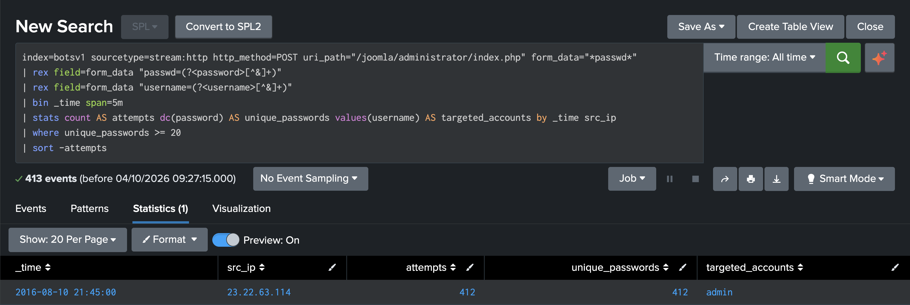
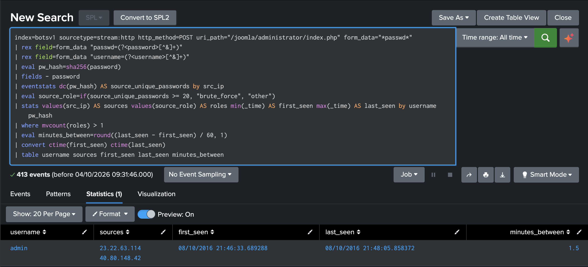

# Detection 02: Brute Force and Credential Reuse

Severity: medium (02a), high (02b)
Status: validated against the BOTSv1 attack-only dataset

## Overview

This detection has two searches because the attack happened in two stages. The first search (02a) flags a single source submitting a large number of different passwords to the Joomla admin login in a short period. The second (02b) looks for a password that was tried by one of those brute-forcing sources and later submitted from a different address, which in this dataset is the point at which the attacker gained access.

I ended up writing 02b after realising 02a missed the actual compromise. The attacker guessed the password from one IP, then logged in from another with a single attempt. Judged on its own, that login looks entirely ordinary.

## ATT&CK mapping

| Search | Tactic | Technique |
|---|---|---|
| 02a | Credential Access (TA0006) | T1110.001 Brute Force: Password Guessing |
| 02b | Initial Access (TA0001) | T1078 Valid Accounts |

## Data

Splunk Stream HTTP data (`index=botsv1`, `sourcetype=stream:http`), using `src_ip`, `http_method`, `uri_path` and `form_data`. The target is the Joomla administrator login at `/joomla/administrator/index.php`.

## Timeline

All times are on 10 August 2016.

| Time | Source | Activity |
|---|---|---|
| 21:00 to 22:00 | 40.80.148.42 | Vulnerability scan (Detection 01) |
| 21:45 | 23.22.63.114 | 412 login attempts against `admin`, each with a different password, at roughly ten per second |
| 21:46:33 | 23.22.63.114 | Submits the correct password |
| 21:48:05 | 40.80.148.42 | Logs in as `admin` with the same password on the first attempt |
| From 21:50 | 40.80.148.42 | Further POST requests to the admin page without credentials, consistent with an authenticated session |

Joomla returned HTTP 303 for every login attempt, whether it succeeded or not, so the response code was no help in telling failures from the successful guess. I had to work from the submitted form data instead.

## 02a: brute force

```spl
index=botsv1 sourcetype=stream:http http_method=POST uri_path="/joomla/administrator/index.php" form_data="*passwd*"
| rex field=form_data "passwd=(?<password>[^&]+)"
| rex field=form_data "username=(?<username>[^&]+)"
| bin _time span=5m
| stats count AS attempts dc(password) AS unique_passwords values(username) AS targeted_accounts by _time src_ip
| where unique_passwords >= 20
| sort -attempts
```

The two `rex` statements extract the password and username from the form body, taking everything after `passwd=` or `username=` up to the next `&`. The search counts distinct passwords per source in five-minute windows and does not output the passwords themselves.

I set the threshold at 20. No legitimate source in the data submitted more than one password in any window, account lockout policies commonly trigger somewhere between five and ten failures, and the attack itself reached 412. That leaves plenty of room to catch a much slower attempt without flagging someone who has simply mistyped a few times.

It returned one result: `23.22.63.114`, 412 attempts, 412 distinct passwords, all against `admin`.



## 02b: credential reuse after brute force

```spl
index=botsv1 sourcetype=stream:http http_method=POST uri_path="/joomla/administrator/index.php" form_data="*passwd*"
| rex field=form_data "passwd=(?<password>[^&]+)"
| rex field=form_data "username=(?<username>[^&]+)"
| eval pw_hash=sha256(password)
| fields - password
| eventstats dc(pw_hash) AS source_unique_passwords by src_ip
| eval source_role=if(source_unique_passwords >= 20, "brute_force", "other")
| stats values(src_ip) AS sources values(source_role) AS roles min(_time) AS first_seen max(_time) AS last_seen by username pw_hash
| where mvcount(roles) > 1
| eval minutes_between=round((last_seen - first_seen) / 60, 1)
| convert ctime(first_seen) ctime(last_seen)
| table username sources first_seen last_seen minutes_between
```

Each password is hashed with SHA-256 and the plaintext field is dropped immediately. Sources that tried 20 or more distinct passwords are labelled as brute forcing, using the same threshold as 02a, and everything else is labelled as other. The search then groups by account and password hash and keeps any combination submitted by both kinds of source.

It returned one result: the `admin` account, used from `23.22.63.114` and `40.80.148.42`, with a minute and a half between the successful guess and the login.



## Passwords in the index

Because Stream captured the full body of every login request, every password entered into this form, including those of legitimate users, is stored in the index in plaintext and readable by anyone with search access to it.

Both searches avoid displaying passwords, but that only limits exposure in results. Hashing at search time is not meaningful protection either, since an unsalted SHA-256 of a common password can be looked up almost instantly. The proper fix is to stop capturing login request bodies, or to mask password fields before they are indexed.

## Evasion

Thinking about how I would avoid these searches as the attacker:

- Password spraying, where one password is tried against many accounts, keeps each account to a single attempt, so 02a never fires. A companion search counting distinct usernames per source would cover it.
- Spreading the guesses across many IP addresses keeps every source under 20. That defeats 02a and also stops 02b from labelling any source as brute forcing. Aggregating by target account rather than by source would help.
- If the attacker logs in from the same IP they brute forced from, 02b finds nothing, because it only looks for reuse from a different address. 02a would still fire, but nothing would indicate that a guess succeeded. Detecting that would need a success signal, such as the same source going on to make authenticated requests, which I have left as future work.
- Credential stuffing with a password from an earlier breach involves no guessing at all, so neither search applies.

## False positives

For 02a, the most likely causes are authorised penetration testing or a misbehaving script retrying a login, although the latter would rarely cycle through many different passwords.

For 02b, the main risk is shared egress. If many users sit behind one NAT or proxy address, enough failed logins could push that address over the threshold and label it as brute forcing. A legitimate user who then logs in from elsewhere with the same password would match.

## Contributing factors

Any one of these controls would have stopped the attack at this stage:

- a stronger admin password (this one appears in common wordlists)
- account lockout after repeated failures
- multi-factor authentication (MFA) on the admin login

## Response

1. Treat the account as compromised. Reset the password, end active sessions and enable MFA.
2. Review everything the second source did after logging in. Detection 03 continues from here.
3. Block both addresses at the firewall or web application firewall (WAF) in line with policy.

## Investigation notes

23.22.63.114 first stood out in the baseline for Detection 01: plenty of requests, but only two paths and 183 different user agents. Breaking its traffic down by method, path and status showed it was alternating between fetching and posting to the Joomla admin login.

Every POST returned 303, so the status codes couldn't tell me whether any guess worked. The form data could. Each submission used the username admin with a different password, roughly ten a second.

Two counts didn't match along the way. One search found 412 login POSTs and another 411, and a later search on the uploaded file showed the same off-by-one. Both turned out to be stats dropping events where one of the grouping fields was empty, which I now check for whenever totals disagree. A misspelt path in one search also returned nothing rather than an error, another reminder that an empty result needs checking before it is trusted.

The baseline of every source posting to the login page produced the key finding. Alongside the 412 attempts, 40.80.148.42 had made a single login with a password in the same five-minute window, followed by admin activity with no credentials. To test whether that password came from the brute force, I looked for any password submitted from more than one address. Exactly one was, from both IPs, ninety seconds apart.

That was when I realised 02a on its own would never have flagged the actual compromise, and wrote 02b, hashing the passwords so the search could compare them without displaying them.
