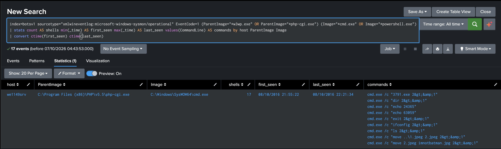
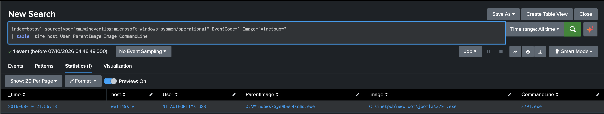

# Detection 03: Web Shell and Executable in the Web Root

Severity: high (both searches)
Status: validated against the BOTSv1 attack-only dataset

## Overview

These two searches cover what happened on the web server after the attacker logged in to Joomla. 03a flags the web server software (the IIS worker process or PHP) starting a command shell. 03b flags any program running from the website's own folder. Neither one relies on the file names the attacker used, because those would just change next time.

## ATT&CK mapping

| Search | Tactic | Technique |
|---|---|---|
| 03a | Persistence (TA0003) | T1505.003 Server Software Component: Web Shell |
| 03a | Execution (TA0002) | T1059.003 Command and Scripting Interpreter: Windows Command Shell |
| 03b | Command and Control (TA0011) | T1105 Ingress Tool Transfer |

The data doesn't show how 3791.exe reached the web root, so the T1105 mapping reflects where the file was found rather than an observed transfer.

## Data

Sysmon process creation events (EventCode 1) in `index=botsv1`, parsed by the `TA-botsv1-sysmon` add-on in this repository. Fields: `host`, `User`, `ParentImage`, `Image`, `CommandLine`. Stream HTTP and IIS logs provided supporting context.

## Timeline

All times are on 10 August 2016, on `we1149srv` (192.168.250.70).

| Time | Activity |
|---|---|
| 21:50:31 | 40.80.148.42 uploads `agent.php` through the Joomla admin panel |
| 21:55:22 | 23.22.63.114 requests `agent.php` for the first time. In the same second, `php-cgi.exe` starts `cmd.exe` to run `echo 24365` |
| 21:55:24 to 21:55:33 | `dir`, `ls` and `ifconfig` through the web shell. `ls` and `ifconfig` are Unix commands, which suggests the attacker was working out which operating system they had reached |
| 21:56:18 | The web shell runs `3791.exe` from `C:\inetpub\wwwroot\joomla\` |
| 21:58:23 and 22:08:13 | `3791.exe` starts its own command shells. `net`, `whoami`, `tasklist`, `find`, `ping` and `nslookup` follow, and the timing suggests they ran through these shells |
| 22:13 to 22:20 | Further `dir` commands through the web shell |
| 22:20:10 and 22:20:33 | `move ..\1.jpeg 2.jpeg`, then `move 2.jpeg imnotbatman.jpg`, consistent with replacing an image on the site |
| 22:21:34 | Final `exit` through the web shell, and the last request to `agent.php` |

## 03a: web server starting a command shell

```spl
index=botsv1 sourcetype="xmlwineventlog:microsoft-windows-sysmon/operational" EventCode=1 (ParentImage="*w3wp.exe" OR ParentImage="*php-cgi.exe") (Image="*cmd.exe" OR Image="*powershell.exe")
| stats count AS shells min(_time) AS first_seen max(_time) AS last_seen values(CommandLine) AS commands by host ParentImage Image
| convert ctime(first_seen) ctime(last_seen)
```

The parents are the IIS worker process and the PHP runtime. The children are `cmd.exe` and `powershell.exe`. PowerShell didn't appear in this attack, but it is a common alternative in web shells, so I included it. `values(CommandLine)` collects the distinct commands into a single cell, which gives an analyst the whole session without a second search.

Before finalising it, I ran the same filter across every host and every day in the dataset. It returned one combination: `php-cgi.exe` starting `cmd.exe` on `we1149srv` on 10 August, 17 times. `w3wp.exe` never started a shell, and `powershell.exe` never appeared.

It returned one result: 17 shells between 21:55:22 and 22:21:34, covering nine distinct commands.



The command lines in the screenshot end in `2&gt;&amp;1`. Sysmon stores events as XML, which escapes `>` and `&`, so the command was actually `2>&1`. That sends error output back alongside normal output, so the attacker sees both through the web shell.

## 03b: program running from the web root

```spl
index=botsv1 sourcetype="xmlwineventlog:microsoft-windows-sysmon/operational" EventCode=1 Image="*inetpub*"
| table _time host User ParentImage Image CommandLine
```

A website's directory should hold pages, scripts and images. It should never be the location of a running program.

Across every host and every day, this returned a single event: `cmd.exe` starting `C:\inetpub\wwwroot\joomla\3791.exe` at 21:56:18, running as `NT AUTHORITY\IUSR`. IUSR is the built-in account IIS uses for anonymous requests. It has low privileges, so the attacker inherited the web server's anonymous identity rather than administrative rights on the host.



## Evasion

Ways I could get around these as the attacker:

- A web shell that uses PHP's own file and network functions never starts a process, so 03a sees nothing. File integrity monitoring on the web root would cover that gap.
- Copying `cmd.exe` to a different name defeats a match on the image path. Where Sysmon records the original file name from the binary's version information, matching on that would be harder to evade.
- Placing the executable outside the web root, in a temporary folder for example, avoids 03b. A broader search for any program started under the IUSR account would catch it.
- Using another interpreter, such as `wscript.exe`, `cscript.exe` or `rundll32.exe`, avoids the child list in 03a. The list should grow as new techniques appear.

## False positives

Some web applications legitimately call operating system commands for image processing, scheduled jobs or report generation. Those would trigger 03a and would need allowlisting by exact command line. Deployment tooling that runs an installer from a site directory could trigger 03b. Neither occurred in this data.

## Limitations

The baseline is thin: three hosts with Sysmon data across two days.

`*inetpub*` matches anywhere in the path and only covers IIS's default location. A site hosted elsewhere would need its own path added.

## Response

1. Isolate the web server from the network.
2. Preserve copies of `agent.php` and `3791.exe`, record their hashes, then remove them from the web root.
3. Reset the Joomla admin credentials (see Detection 02) and look for any other uploaded files.
4. Review what IUSR is able to write to in the web root, and restrict it.
5. Restore any altered site content from a known good copy.

## Investigation notes

Detection 02 ended with the attacker logged in to the Joomla admin panel, so my first question was whether they'd uploaded anything. The Stream data showed one file, `agent.php`, posted to the admin page at 21:50:31. Every request for it after that came from the brute-force address, starting five minutes later.

None of those requests had a query string. My first search for one came back empty, and before I read anything into that I checked whether the field existed at all. It did, for thousands of other requests, so the empty result was real: nothing was being passed to `agent.php` in the URL. That was as far as the HTTP data could take me, so I moved to the endpoint data.

That meant working out which host was 192.168.250.70. The name `we1149srv` looked likely, but I didn't want to go on a naming convention. A plain search for the IP showed `we1149srv` logging it more than 22,000 times in its own IIS logs, and a raw log line had it in the server IP field. I also counted that host's Sysmon events by day to make sure it was recording on 10 August, so an empty process search would actually mean something.

My first look at that day's process starts gave me 6 events when I expected 105. Event sampling had been switched to 1 in 10. With sampling off, the full set showed `php-cgi.exe` starting `cmd.exe`, a program running from the web root, and a run of discovery commands. Now I check the sampling setting along with the event count and time range before I trust any result.

