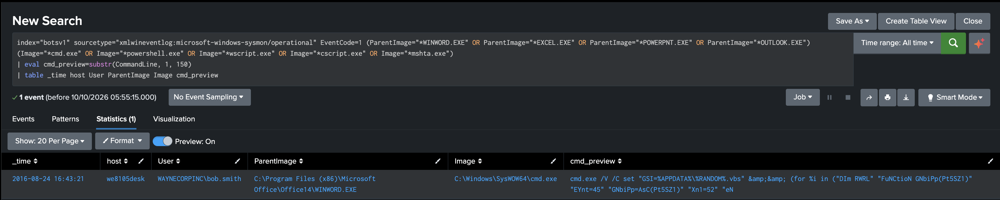

# Detection 04: Office Application Starting a Shell or Script Host

Severity: high
Status: validated against the BOTSv1 attack-only dataset

## Overview

This search flags a Microsoft Office application (Word, Excel, PowerPoint or Outlook) starting a command shell or script host. Office applications open and edit documents. They have very little legitimate reason to start `cmd.exe`, PowerShell or the Windows Script Host, so when they do, it usually means a macro in a document is running code.

In this dataset it catches the first step of the ransomware infection on Bob Smith's workstation: a Word macro writing a VBScript downloader to disk and running it.

## ATT&CK mapping

| Tactic | Technique |
|---|---|
| Execution (TA0002) | T1204.002 User Execution: Malicious File |
| Execution (TA0002) | T1059.003 Command and Scripting Interpreter: Windows Command Shell |
| Execution (TA0002) | T1059.005 Command and Scripting Interpreter: Visual Basic |
| Defense Evasion (TA0005) | T1027 Obfuscated Files or Information |

The data doesn't show how the document reached Bob, so I haven't mapped a delivery technique such as phishing.

## Data

Sysmon process creation events (EventCode 1) in `index=botsv1`, parsed by the `TA-botsv1-sysmon` add-on in this repository. Fields: `host`, `User`, `ParentImage`, `Image`, `CommandLine`.

## Timeline

All times are on 24 August 2016, on `we8105desk`, under the account `WAYNECORPINC\bob.smith`.

| Time | Activity |
|---|---|
| 16:43:21 | Word starts `cmd.exe`, which writes a VBScript file to `%APPDATA%` under a random numeric name and starts it |
| 16:43:21 | That `cmd.exe` starts `wscript.exe` running `AppData\Roaming\20429.vbs` |
| 16:43:27 | Word starts `splwow64.exe`, the print driver host. Benign |
| 16:48:21 | `wscript.exe` starts `cmd.exe`, which runs `AppData\Roaming\121214.tmp` |
| 17:15:12 | A program named `osk.exe`, running from a random-named folder in `AppData\Roaming`, starts `wscript.exe` to open `# DECRYPT MY FILES #.vbs` on the desktop |

The genuine On-Screen Keyboard lives in `C:\Windows\System32`, so the `osk.exe` here is masquerading as it. Everything from 16:48 onwards belongs to the ransomware itself and is outside this detection.

## Search

```spl
index=botsv1 sourcetype="xmlwineventlog:microsoft-windows-sysmon/operational" EventCode=1 (ParentImage="*WINWORD.EXE" OR ParentImage="*EXCEL.EXE" OR ParentImage="*POWERPNT.EXE" OR ParentImage="*OUTLOOK.EXE") (Image="*cmd.exe" OR Image="*powershell.exe" OR Image="*wscript.exe" OR Image="*cscript.exe" OR Image="*mshta.exe")
| eval cmd_preview=substr(CommandLine, 1, 150)
| table _time host User ParentImage Image cmd_preview
```

The first bracket lists the Office applications and the second lists the programs a macro typically hands off to. An event has to match one from each list. Only the attack used `cmd.exe`, but I included the others because macros commonly use PowerShell, either script host or `mshta.exe` instead.

The macro's command line runs to hundreds of lines, so `substr` keeps the first 150 characters as a preview. That is enough to see the VBScript being written to AppData without the full script filling the alert.

## Baseline

Before finalising it, I summarised the same filter by host, day, parent and child across the whole dataset. It returned a single row: Word starting `cmd.exe` on `we8105desk` on 24 August, once. Excel, PowerPoint and Outlook never started any of the listed programs, and PowerShell and `mshta.exe` never appeared.

Word also started `splwow64.exe` six seconds after the macro ran. That is the print driver host Office uses for printing, and it isn't in the child list, so it doesn't trigger the search.

## Validation

One result: 16:43:21, `we8105desk`, `WAYNECORPINC\bob.smith`, `WINWORD.EXE` starting `cmd.exe` with a command line beginning `cmd.exe /V /C set "GSI=%APPDATA%\%RANDOM%.vbs"`.



The full command line writes each line of an obfuscated VBScript into that file with a `for` loop, then runs it with `start`. The script uses random capitalisation, padding lines and hex-encoded strings, but the fragments that survive (`.Open`, `.SetRequestHeader`, `.Send`, `.SaveToFile`, `WScript.Sleep`) are consistent with a downloader. Five minutes later the script host ran `121214.tmp` from the same folder.

## Evasion

Thinking about how I would avoid this search as the attacker:

- Having the macro start its payload through WMI or a scheduled task makes the new process a child of `WmiPrvSE.exe` or `svchost.exe` rather than Word, so the parent list never matches.
- Spoofing the parent process ID makes a process appear to have been started by something else.
- Handing off to a program not on the child list, such as `rundll32.exe`, `regsvr32.exe` or `certutil.exe`, avoids the second bracket. The list needs to grow as new techniques appear.
- Downloading the payload inside the macro itself, without starting a separate process, leaves nothing for this search to see.
- Using an Office application not on the parent list, such as Access or Publisher, avoids the first bracket.

## False positives

Some organisations rely on macros or add-ins that legitimately call `cmd.exe` or a script host, for example in finance or reporting workbooks. Those would trigger this search and would need allowlisting by exact command line or document path. Printing from Office starts `splwow64.exe`, which is deliberately not covered.

## Limitations

The baseline is thin: three hosts with Sysmon data across two days, and one user workstation. The parent and child lists cover common cases rather than every variant.

## Response

1. Isolate `we8105desk` from the network before the payload spreads further or encrypts shared drives.
2. Identify the document Bob opened and where it came from, and look for the same document on other machines and in email.
3. Preserve and hash `20429.vbs`, `121214.tmp` and the masquerading `osk.exe` for analysis.
4. Treat the ransomware stage as a separate incident. Detection 05 covers it.

## Investigation notes

I started by checking which days Sysmon covered on the desktop. Both 10 and 24 August had process creation events, and 24 August stood out, with network connections up from 883 to 52,453.

Rather than searching for Office straight away, I listed every program that had started other programs on the desktop, by day. Word appeared as a parent on 24 August alongside two other things that didn't belong: a `.tmp` file running as a program from AppData, and an `osk.exe` running from a random-named folder.

Word had started two processes. One was the print driver host. The other was `cmd.exe`, with a command line that built a VBScript file line by line and ran it. My first attempt at that search returned 588 events instead of 2, because I had left off the Word filter. The event count caught it immediately.

I initially assumed the script host had run the dropped VBScript, because that's what Windows does with `.vbs` files by default, but nothing I'd seen in the data showed it. Searching for `wscript.exe` itself, with its parent, settled it: the same `cmd.exe` started it at the same second, running `20429.vbs` from AppData. The same search also turned up the ransom note being opened by the fake `osk.exe` half an hour later.
