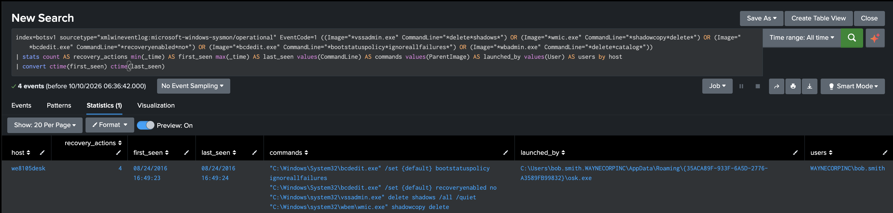

# Detection 05: Ransomware Disabling System Recovery

Severity: critical
Status: validated against the BOTSv1 attack-only dataset

## Overview

This flags the commands ransomware uses to stop a victim recovering their files without paying: deleting Volume Shadow Copies, deleting the Windows backup catalogue, and switching off Windows recovery. Normal users almost never run these, so when they show up it's a strong sign something is about to encrypt the machine, or already is.

In this data it fires 26 minutes before the ransom notes appeared on Bob Smith's workstation.

## ATT&CK mapping

| Tactic | Technique |
|---|---|
| Impact (TA0040) | T1490 Inhibit System Recovery |

Also seen in the same chain, but not what this search detects: T1036.005 Masquerading (the payload ran as a fake `osk.exe`) and T1070.004 File Deletion (both the payload and its dropper deleted themselves). The encryption itself (T1486) isn't directly visible in the process data, so I haven't claimed it here.

## Data

Sysmon process creation events (EventCode 1) in `index=botsv1`, parsed by the `TA-botsv1-sysmon` add-on in this repository. Fields: `host`, `User`, `ParentImage`, `Image`, `CommandLine`.

## Timeline

All times are on 24 August 2016, on `we8105desk`, under `WAYNECORPINC\bob.smith`. This picks up where Detection 04 ends.

| Time | Activity |
|---|---|
| 16:48:21 | The dropped VBScript runs `121214.tmp` from `AppData\Roaming` |
| 16:48:41 | `121214.tmp` starts `osk.exe` from `AppData\Roaming\{35ACA89F-933F-6A5D-2776-A3589FB99832}\`, then kills and deletes itself |
| 16:49:23 | The fake `osk.exe` runs `wmic shadowcopy delete` and `vssadmin delete shadows /all /quiet` |
| 16:49:24 | It runs `bcdedit /set {default} recoveryenabled no` and `bcdedit /set {default} bootstatuspolicy ignoreallfailures` |
| 16:49 to 17:15 | No new processes from the fake `osk.exe` |
| 17:15:11 | It opens `# DECRYPT MY FILES #.txt` in Notepad and starts Internet Explorer |
| 17:15:12 | It runs `# DECRYPT MY FILES #.vbs` from the desktop |
| 17:15:29 | It kills and deletes itself |

The real On-Screen Keyboard lives in `C:\Windows\System32`, so the `osk.exe` here is masquerading as it.

## Search

```spl
index=botsv1 sourcetype="xmlwineventlog:microsoft-windows-sysmon/operational" EventCode=1 ((Image="*vssadmin.exe" CommandLine="*delete*shadows*") OR (Image="*wmic.exe" CommandLine="*shadowcopy*delete*") OR (Image="*bcdedit.exe" CommandLine="*recoveryenabled*no*") OR (Image="*bcdedit.exe" CommandLine="*bootstatuspolicy*ignoreallfailures*") OR (Image="*wbadmin.exe" CommandLine="*delete*catalog*"))
| stats count AS recovery_actions min(_time) AS first_seen max(_time) AS last_seen values(CommandLine) AS commands values(ParentImage) AS launched_by values(User) AS users by host
| convert ctime(first_seen) ctime(last_seen)
```

Each pair in brackets is a tool and what it was told to do. The tool on its own isn't the problem: admins run `vssadmin list shadows` to check backups. It's the tool together with a delete or disable command that matters. The parent isn't part of the match, because it could be anything, but `launched_by` shows it so whoever picks up the alert can go straight to the program responsible.

`wbadmin delete catalog` didn't appear in this attack. I included it because it's another common way ransomware removes backups.

## Baseline

Before finalising it, I ran the same filter across every host and every day, grouped by host, day, program and command line. It returned four events, all on `we8105desk` on 24 August, and all from the attack. `wbadmin` never appeared.

## Validation

One result: `we8105desk`, four recovery actions between 16:49:23 and 16:49:24, all launched by the fake `osk.exe` in AppData, under `WAYNECORPINC\bob.smith`.



The ransomware used two different tools to delete the shadow copies, `wmic` and `vssadmin`, in the same second. Doing it twice means it still works if one of them is blocked.

## Evasion

Ways ransomware could get past this:

- Deleting shadow copies through PowerShell or a WMI call made directly from its own code, instead of running `vssadmin` or `wmic`, means none of these tools start.
- Shrinking the shadow copy storage with `vssadmin resize shadowstorage` until Windows deletes the copies itself avoids the `delete` pattern.
- Copying `vssadmin.exe` to a different name gets past the image path match.
- Some ransomware doesn't touch backups at all, so this only catches the families that do. Most current ones do.

## False positives

Backup software and administrators sometimes delete old shadow copies, for example `vssadmin delete shadows /oldest`, and IT teams occasionally change boot settings on kiosks or lab machines. Those would match. They'd need allowlisting by parent process or account, and anything left over is worth a look regardless.

## Limitations

The baseline is thin: three hosts with Sysmon data across two days. The list of commands covers the common cases, not every way to remove backups.

## Response

This is the point to act fast. Here the commands ran 26 minutes before the ransom notes appeared.

1. Isolate `we8105desk` from the network straight away, before it can reach shared drives.
2. Check other hosts for the same commands and for the fake `osk.exe` path.
3. Preserve memory and disk if possible. Both the payload and its dropper delete themselves.
4. Restore from backups held off the machine. The local shadow copies are gone.

## Investigation notes

Detection 04 left one link unproven: whether `121214.tmp` started the fake `osk.exe`. Searching for everything `121214.tmp` launched settled it. It restarted itself, started the fake `osk.exe` from a random-named folder in AppData, then used `taskkill`, a one-second `ping` and `del` to kill and delete itself.

Next I looked at everything the fake `osk.exe` launched. Eleven processes, and in the middle of them, within two seconds, it deleted the shadow copies twice with two different tools and switched off Windows recovery. Then nothing for 26 minutes until the ransom notes, and finally it deleted itself the same way.

My original plan for this detection was ransomware file activity over SMB, but I hadn't checked whether that data was there, and this was a cleaner signal that fires earlier. So I built it on these commands instead and left SMB as future work.

When I baselined it across every host and day, only the four attack commands matched. One of them was `WMIC.exe` in capitals, which still matched my lowercase search because Splunk doesn't care about case when matching field values.
